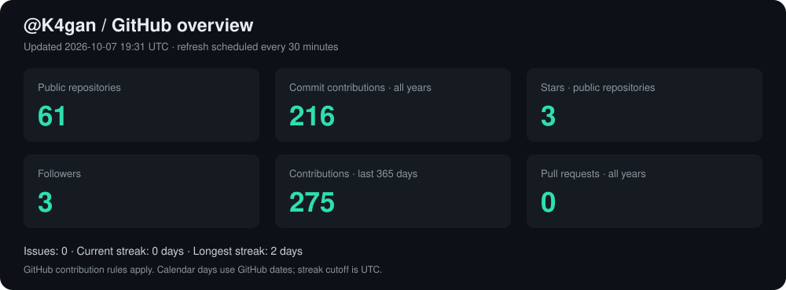
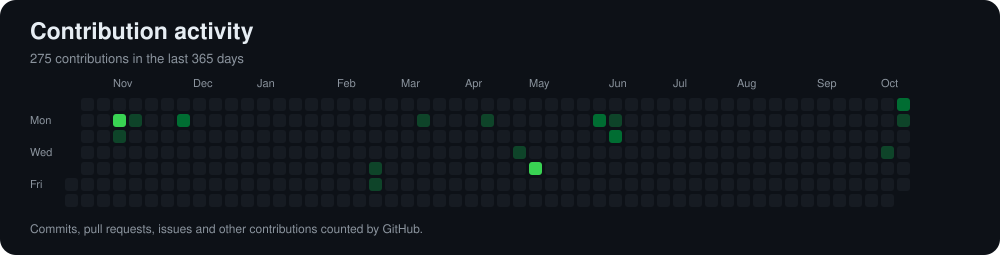
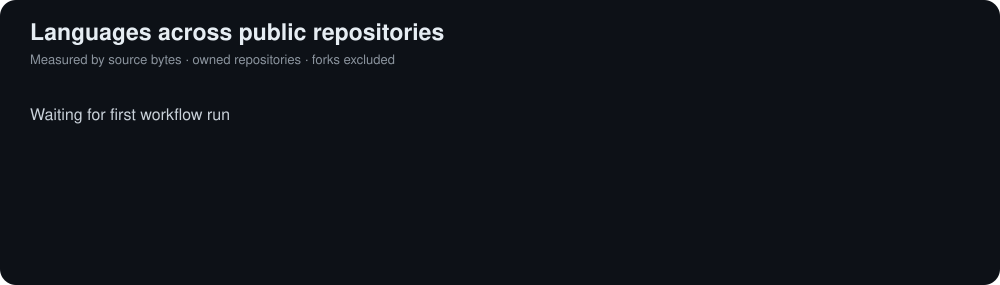

<h1>Oğuz Kağan Kahraman</h1>
<h3>Versatil bir adamım.</h3>

## Hakkımda

Yazılım mühendisliği, yapay zekâ ve veriyle ilgileniyorum. Backend, web ve mobil uygulamalar geliştiriyor; farklı teknolojileri denemeyi seviyorum.

## GitHub istatistiklerim

Bu sayılar nasıl hesaplanıyor?

- Kartlar GitHub Actions ile **30 dakikada bir** güncellenir. Güncelleme zamanı ilk kartta görünür; GitHub iş sırası ve görsel önbelleği ek gecikme yaratabilir.
- **Public repositories:** Sahip olduğum herkese açık repolar; fork repolar da sayıya dahildir.
- **Commit contributions:** Hesabın açıldığı yıldan bugüne GitHub’ın katkı olarak saydığı commitler. Yalnızca bu yılın sayısı değildir. Her branch’teki her Git commitinin sayımı değildir.
- **Contributions:** Son 365 gündeki katkı takvimi toplamı; commit, issue, PR ve diğer katkıları kapsar.
- **Stars:** Sahip olduğum public repoların aldığı yıldızların toplamı.
- **Pull requests / Issues:** Tüm yıllar için API’nin döndürdüğü katkı sayıları.
- **Streak:** GitHub takvim tarihleri kullanılır; bugünün tamamlanmadığı durumlarda dün başlayan seri korunur. Gün sınırı UTC’dir.
- **Languages:** Public, bana ait, fork olmayan repolardaki kaynak kodun bayt dağılımı; yetkinlik ölçüsü değildir.
- Private katkıların commit toplamına eksiksiz eklenmesi için isteğe bağlı `PROFILE_TOKEN` ayarı gerekir. Görünmeyen private katkılar commit sayısı diye tahmin edilmez.

## Teknolojiler

### Diller

### Framework ve runtime

### Veritabanı ve backend

### Yapay zekâ ve veri

### Bulut ve araçlar

---

  Build. Break. Learn. Repeat.

